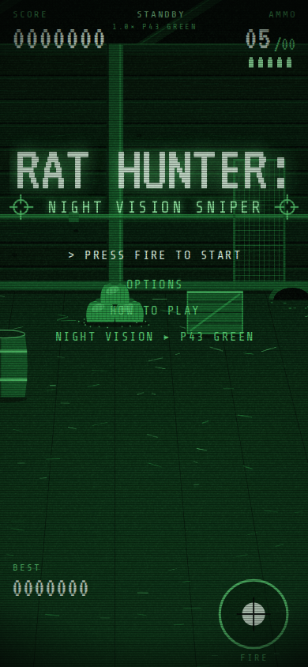
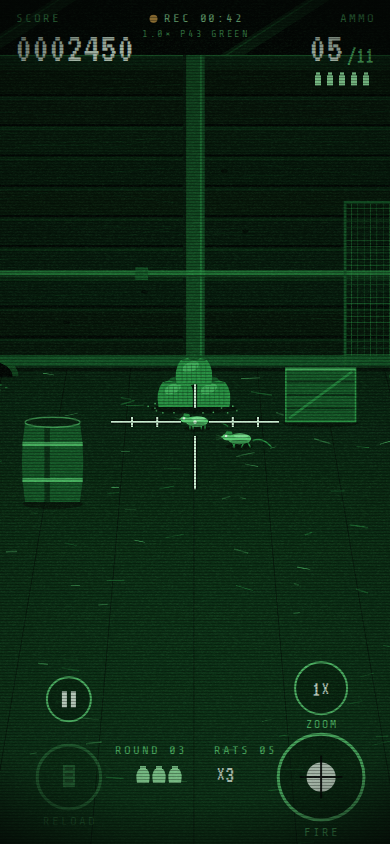

# Rat Hunter: Night Vision Sniper

An arcade sniper game for iPhone, built from the viral clip of a man clearing rats one by one through a night-vision scope after his traps stopped working.

You look through the scope. Rats come out of the holes and go for the grain. Drag to pan, wait for the rat to stop and sniff, tap anywhere to fire. A rat that carries a sack back to its hole steals it. Lose all three sacks and the game is over.

<p>
  
  
</p>

The whole game is one file, `docs/index.html`, with no build step and no dependencies. It runs in Safari, as a home-screen app, and inside the native iPhone app in `ios/`.

## Play it on your iPhone today (no Mac needed)

1. On GitHub, open **Settings → Pages**. Under **Build and deployment**, set **Source** to *Deploy from a branch*, pick the branch (`main` once this is merged, or the feature branch to test it first) and the **/docs** folder, and save.
2. After a minute the game is live at `https://ravikumar191191.github.io/greenforest/`.
3. Open that link in Safari on your iPhone, tap the **Share** button, then **Add to Home Screen**.

The home-screen copy runs full screen with no browser bars, keeps working offline, and gets its own icon. Sound needs one tap first because iOS mutes audio until you interact.

## Try it in the iPhone Simulator (Mac)

1. Open `ios/RatHunter.xcodeproj` in Xcode.
2. In the run destination menu at the top, pick any iPhone simulator (for example *iPhone 16*).
3. Press **Run** (⌘R). No signing or Apple ID is needed for the Simulator.

Click and drag stands in for a finger. Haptics do not fire in the Simulator; everything else, including sound, works. **Device → Rotate** tests landscape.

## Ship it as a real iPhone app

The `ios/` folder is an Xcode project that wraps the game in a full-screen web view and adds Taptic feedback for shots and hits. It was written by hand rather than generated by Xcode, so if Xcode ever refuses to open it, the fallback in **If Xcode complains** below takes five minutes.

You need a Mac with Xcode 15 or newer and an Apple ID.

1. Open `ios/RatHunter.xcodeproj`.
2. Select the **RatHunter** target, then **Signing & Capabilities**. Turn on **Automatically manage signing** and pick your **Team** (your personal Apple ID works).
3. Change the **Bundle Identifier** from `com.greenforest.rathunter` to something of your own, such as `com.yourname.rathunter`.
4. Plug in your iPhone, pick it as the run destination, and press **Run**.

The first time, iOS asks you to trust the developer certificate under **Settings → General → VPN & Device Management**.

With a free Apple ID the install expires after 7 days and you re-run from Xcode. With a paid Apple Developer account (US$99/year) you can ship through TestFlight or the App Store instead. For a store release, replace the bundle identifier and the app icon at `ios/RatHunter/Assets.xcassets/AppIcon.appiconset/icon-1024.png` with your own.

### If Xcode complains

Create a fresh project in Xcode: **File → New → Project → iOS → App**, name it `RatHunter`, interface SwiftUI. Then:

1. Delete the generated `ContentView.swift`. Drag `ios/RatHunter/GameView.swift` and `ios/RatHunter/RatHunterApp.swift` into the project (replace the generated `RatHunterApp.swift`).
2. Drag the `docs` folder from this repo into the project navigator. In the dialog choose **Create folder references** (the folder must show as blue, not yellow). The Swift code loads `docs/index.html` from the app bundle.
3. In the target's **Info** tab add `Status bar is initially hidden` = YES and `View controller-based status bar appearance` = NO.
4. Run.

## Controls

| On the phone | On a keyboard (desktop testing) |
| --- | --- |
| Drag anywhere to pan the scope | Arrow keys, or drag with the mouse |
| Tap anywhere to fire (the **FIRE** button works too) | Click, Space or Enter |
| **RELOAD** button (also automatic when the magazine is empty) | R |
| **ZOOM** button, 1× / 2× | Z |
| **II** pauses | P or Esc |
| Options → Night vision | N cycles the five palettes |
| Options → Sound | M mutes |

Options also let you move the FIRE button to the left side, turn tap-anywhere-to-fire off (button only), and change the aim speed. Settings and the best score are remembered on the device.

## How the game works

- **Rounds.** Round *n* has *4 + n* rats (up to 14). You are issued 3 rounds of ammo per rat, in 5-round magazines, with a bolt cycle between shots. Leftover ammo and accuracy above 50% earn a bonus at the end of the round.
- **Rats.** They come out of four holes, stop to sniff, sometimes hide behind the hay, barrels and crates, then either cross the barn or go for the grain pile. A rat that finishes eating runs home carrying a sack; stop it before it reaches a hole. Faster and less patient every round.
- **Scoring.** 100 per rat, more for a moving rat and for a distant one. Hits in a row multiply the score up to 3×. A miss resets the streak.
- **The tube.** Five palettes, switchable from the title screen, Options or the pause menu: white phosphor (the look of the original clip, the default), digital (the cool tint of a modern low-light sensor), amber, thermal (ironbow: cold purple, hot orange rats) and P43 green (the classic image intensifier). The overlay, noise, scanlines and auto-gain dip after a muzzle flash are all drawn on a `<canvas>`; there are no image assets.
- **First play.** The first round coaches you: a pulsing prompt to drag, then a ring around FIRE until your first shot. After that the hints never come back.

## Project layout

```
docs/                     the game, served by GitHub Pages and bundled into the iOS app
  index.html              everything: markup, styles, embedded fonts, game code
  manifest.webmanifest    home-screen metadata
  sw.js                   offline cache (bump CACHE in it when you change index.html)
  icons/                  home-screen icons
ios/
  RatHunter.xcodeproj     Xcode project (docs/ is referenced as a folder, not copied)
  RatHunter/              SwiftUI app: full-screen WKWebView + haptics bridge
assets/                   screenshots for this README
```

To tweak the game, edit the `CFG` block at the top of the script in `docs/index.html`: ammo per rat, reload and bolt timing, rat speed, number of sacks, and so on. There is a `window.__rh` object in the console for poking at the running game.

## Credits

Built with plain HTML5 Canvas and Web Audio. Fonts are [VT323](https://fonts.google.com/specimen/VT323) and [Share Tech Mono](https://fonts.google.com/specimen/Share+Tech+Mono), both under the SIL Open Font License and embedded in the page so the game works offline.
